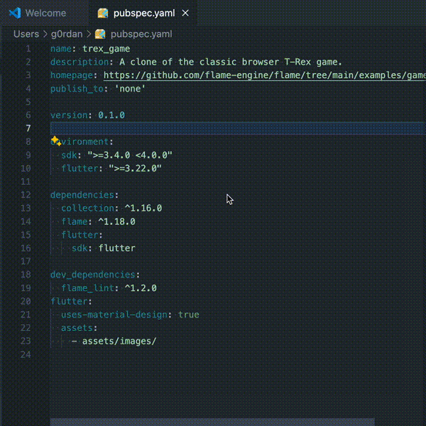

# publink

This extension allows you to see a hover with URL of the [pub.dev](https://pub.dev) package when you hover over the package name in the `pubspec.yaml` file.

## Release Notes

### 0.0.1

Initial release of publink

---
